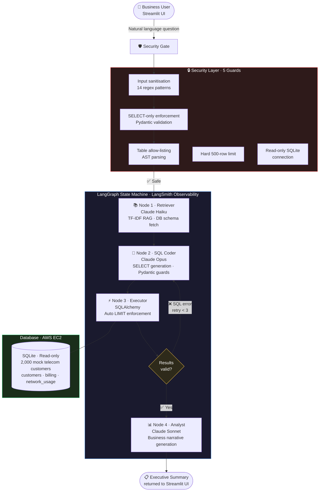

# Multi-Agent BI Orchestrator — Text-to-SQL

<div align="center">

| 🔒 Security Layers | 🤖 Claude Models | 🔁 Self-Correction | 🌐 Deployment |
|:---:|:---:|:---:|:---:|
| **5** independent guards | **3** (Haiku · Opus · Sonnet) | Up to **3 retries** | Live · AWS EC2 |

</div>

A production-deployed, multi-agent AI system that converts plain English business questions into SQL queries, executes them against a telecom database, and returns executive-level summaries — all fully automated.

**Live Demo:** http://3.132.29.156 — *natural language → validated SQL → executive summary in under 3 seconds*
**GitHub:** https://github.com/DevMLAI01/text-to-sql_Mult_Agent-bi-orchestrator

---

## What It Does

Ask a question like:

> *"What percentage of customers have churned for each plan type?"*

And the system automatically:
1. Retrieves relevant business context from a RAG store
2. Generates a validated, safe SQL query using Claude Opus
3. Executes the query against a SQLite telecom database
4. Returns a plain-English executive summary with business insights

No SQL knowledge required. No hallucinated tables. No prompt injection possible.

---

## Live Demo

> Converts natural language questions into validated SQL and executive summaries in under 3 seconds, deployed on AWS EC2 with Nginx serving live traffic.

Visit **http://3.132.29.156** in your browser.

### Sample questions to try:

**Revenue & Billing**
- What is the total unpaid amount owed, broken down by plan type?
- Which Enterprise customers have the largest outstanding unpaid balances?
- Show me total paid revenue for each billing month in 2024, ordered chronologically.

**Churn Analysis**
- What percentage of customers have churned for each plan type?
- Show me churned customers who had both unpaid invoices and more than 15 dropped calls.
- Which customers who signed up after 2022 have already churned and still have unpaid invoices?

**Network Quality**
- Which Enterprise customers had more than 15 dropped calls in any single month?
- Which billing months had the highest average dropped calls count?

**Usage & Segmentation**
- Who are customers that consistently used more than 200 GB of data per month across 3+ months?
- Which Prepaid customers averaged more than 50 GB per month — upsell candidates for Postpaid 5G?

---

## Business Value

| Problem | This System Solves It By |
|---------|--------------------------|
| Business analysts blocked on SQL | Natural language → SQL, no coding needed |
| Wrong tables / hallucinated schema | Pydantic allow-list blocks any unknown table |
| Uninterpretable raw data | Sonnet converts rows into executive narrative |
| Runaway queries crashing the DB | Hard row cap (500 rows) enforced at execution |
| Prompt injection attacks | 14-pattern regex guard blocks all known vectors |
| Single points of failure | Self-correction loop retries up to 3 times |

---

## How It Works

A **4-node multi-model LangGraph pipeline** where each node uses a different Claude model optimised for that task — from fast context retrieval through to executive narrative generation.



### Self-Correction Loop

If the SQL fails (syntax error, wrong column, etc.), the system automatically:
1. Captures the exact error message
2. Injects it back into the SQL Coder prompt
3. Asks the model to fix its own mistake
4. Retries up to **3 times** before graceful failure

---

## Security Guardrails

Four independent layers of protection:

| Layer | Where | What It Blocks |
|-------|-------|----------------|
| **#1 Input Sanitization** | `main.py` / `app.py` | 14 regex patterns for prompt injection (ignore previous instructions, jailbreak, etc.) + 500-char limit |
| **#2 SELECT-Only Guard** | `agents/nodes.py` → `SQLOutput` Pydantic model | Any non-SELECT query (INSERT, DROP, UPDATE, etc.) |
| **#3 Table Allow-List** | `agents/nodes.py` → sqlglot AST | Queries referencing tables outside `{customers, billing, network_usage}` |
| **#4 Row Cap** | `agents/nodes.py` → Node 3 | Appends `LIMIT 500` to any query without an explicit LIMIT |
| **#5 Read-Only Engine** | `database/setup.py` | SQLite opened with `?mode=ro` URI — write operations impossible at driver level |

---

## Model Tier Strategy

Each node uses the Claude model best suited for its task — balancing cost, speed, and capability:

| Node | Model | Reason |
|------|-------|--------|
| Retriever | `claude-haiku-4-5` | Cheap and fast — just summarising context |
| SQL Coder | `claude-opus-4-6` | Most capable — complex SQL generation + self-correction |
| DB Executor | *(none)* | Pure SQLAlchemy — no LLM needed |
| Analyst | `claude-sonnet-4-6` | High-quality prose at lower cost than Opus |

---

## Cloud Architecture

```
Internet
    │
    ▼  port 80
┌───────────────────────────────────────┐
│         AWS EC2 t3.micro              │
│         Amazon Linux 2023             │
│         us-east-2 (Ohio)              │
│                                       │
│   Nginx :80                           │
│     └── reverse proxy ──►             │
│                                       │
│   Streamlit :8501                     │
│     └── app.py                        │
│          └── LangGraph pipeline       │
│               └── telecom.db (SQLite) │
│                                       │
│   systemd: bi-orchestrator.service    │
│   (Restart=always — auto-recovers)    │
│                                       │
│   Elastic IP: 3.132.29.156            │
└───────────────────────────────────────┘
         │                    │
         ▼                    ▼
  Anthropic API          LangSmith
  (Claude models)        (Tracing)
```

---

## 💼 Why This Matters
Business intelligence teams are bottlenecked by the need for SQL expertise to
answer operational questions. This system is designed to eliminate that bottleneck
by routing natural language questions through a 3-model Claude pipeline with
5 independent security guards — making live telecom data accessible to
non-technical stakeholders without exposing the database to injection risks.

---

## Tech Stack

| Layer | Technology |
|-------|-----------|
| **Agent Orchestration** | LangGraph (StateGraph) |
| **LLM Provider** | Anthropic Claude (Haiku, Opus, Sonnet) |
| **Web UI** | Streamlit |
| **Database** | SQLite via SQLAlchemy |
| **SQL Validation** | Pydantic v2 + sqlglot AST |
| **RAG** | Custom TF-IDF cosine similarity (pure Python) |
| **Observability** | LangSmith full tracing |
| **Web Server** | Nginx (reverse proxy) |
| **Process Manager** | systemd |
| **Cloud** | AWS EC2 Free Tier + Elastic IP |
| **Language** | Python 3.9+ |

---

## Project Structure

```
multi-agent-bi-orchestrator/
│
├── app.py                   # Streamlit web UI
├── main.py                  # Interactive CLI (alternative to UI)
├── config.py                # Model IDs, env vars, constants
├── generate_data.py         # Seeds 2,000 mock telecom customers
├── requirements.txt
│
├── agents/
│   ├── state.py             # GraphState TypedDict (8 fields)
│   ├── nodes.py             # 4 node functions + SQLOutput Pydantic guard
│   └── graph.py             # LangGraph StateGraph assembly + routing
│
├── database/
│   ├── setup.py             # SQLite engine (write once, read-only after)
│   └── schema.py            # Live DDL extraction via SQLAlchemy inspect()
│
├── rag/
│   └── chroma_store.py      # TF-IDF RAG: 8 telecom business rule docs
│
├── prompts/
│   └── templates.py         # System prompts for all 3 LLM nodes
│
└── deployment/
    ├── setup.sh             # EC2 one-shot bootstrap script
    ├── nginx.conf           # Reverse proxy with WebSocket support
    └── bi-orchestrator.service  # systemd unit (auto-restart)
```

---

## Component Overview

### `agents/state.py` — Shared State
All 4 nodes read and write to a single `GraphState` TypedDict:

| Field | Type | Purpose |
|-------|------|---------|
| `user_question` | str | Original NL question |
| `business_context` | str | RAG output from Node 1 |
| `database_schema` | str | Live DDL from SQLAlchemy |
| `generated_sql` | str | Validated SQL from Node 2 |
| `execution_error` | str | Error message for self-correction |
| `raw_data_result` | list | Rows returned by Node 3 |
| `final_summary` | str | Executive summary from Node 4 |
| `retry_count` | int | Tracks self-correction attempts |

### `agents/nodes.py` — Node Logic
- **`SQLOutput`** Pydantic model strips markdown fences, enforces SELECT-only, validates tables via sqlglot AST (CTE-aware)
- **`node_3_db_executor`** appends `LIMIT 500` using sqlglot AST detection (not fragile string matching)
- All LLM calls go through a single `_call_llm()` wrapper using the Anthropic Messages API

### `rag/chroma_store.py` — RAG Store
Pure Python TF-IDF implementation (no external vector DB required). Contains 8 business rule documents covering:
- Plan types (Prepaid, Postpaid 5G, Enterprise)
- Churn definitions and thresholds
- Billing cycles and payment status semantics
- Network quality KPIs (dropped calls benchmarks)

### `agents/graph.py` — Routing Logic
```python
# After DB execution:
if execution_error and retry_count < MAX_RETRIES:
    → back to Node 2 (SQL Coder) for self-correction
else:
    → Node 4 (Analyst) for summary
```

---

## Local Setup

### Prerequisites
- Python 3.9+
- [uv](https://docs.astral.sh/uv/) — fast Python package manager (`pip install uv` or see uv docs)
- Anthropic API key (`sk-ant-...`)
- LangSmith API key (`lsv2_...`) — optional but recommended

### Steps

```bash
# 1. Clone
git clone https://github.com/DevMLAI01/text-to-sql_Mult_Agent-bi-orchestrator.git
cd text-to-sql_Mult_Agent-bi-orchestrator

# 2. Install dependencies (using uv)
uv pip install -r requirements.txt

# 3. Configure environment
cp .env.example .env
# Edit .env and fill in your API keys

# 4. Generate mock data (2,000 customers)
python generate_data.py

# 5a. Run the web UI
python -m streamlit run app.py

# 5b. Or use the interactive CLI
python main.py
```

---

## Database Schema

Three tables, 2,000 customers, ~15,000+ billing and usage records:

```sql
customers     (customer_id, name, plan_type, signup_date, churn_status)
billing       (invoice_id, customer_id, billing_month, amount_due, is_paid)
network_usage (usage_id, customer_id, month, data_gb_used, dropped_calls_count)
```

Plan types: `Enterprise`, `Postpaid_5G`, `Prepaid`
Churn statuses: `Active`, `Churned`

---

## Observability

All agent runs are traced in **LangSmith** under the project `bi-orchestrator`.

Each trace captures:
- Input question and initial state
- Node 1 context brief
- Node 2 generated SQL (and any retries)
- Node 3 execution result / error
- Node 4 final summary
- Total latency and token usage per node

---

## Test Results

End-to-end tests run on 2026-03-05:

| Query | SQL Complexity | Rows | Retries | Status |
|-------|---------------|------|---------|--------|
| Unpaid balances by plan type | JOIN + GROUP BY + SUM | 3 | 0 | PASS |
| Churn rate by plan type | CASE WHEN + ROUND + percentage | 3 | 0 | PASS |
| Enterprise SLA breaches | Multi-JOIN + filter | 28 | 0 | PASS |
| Injection: "ignore previous instructions" | — | — | — | BLOCKED |
| Injection: "DROP TABLE customers" | — | — | — | BLOCKED |

---

## Author

**Saurabh Dewangan**
GitHub: [@DevMLAI01](https://github.com/DevMLAI01)

---

*Built with LangGraph · Claude AI · Streamlit · AWS EC2 Free Tier*
